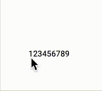

# React Highlight Popup

A light library to highlight the text on screen.

✅ Fully typescript

✅ Lightweight

✅ Unit test

## Demo



## Install

```
npm install react-highlight-popup
```

or

```
yarn add react-highlight-popup
```

## Usage

```
import { HighlightText } from 'react-highlight-popup';

<HighlightText>
    Lorem Ipsum is simply dummy text of the printing and typesetting industry. Lorem Ipsum has been the industry's standard dummy text ever since the 1500s, when an unknown printer took a galley of type and scrambled it to make a type specimen book.
</HighlightText>

//with custom typography
import { Typography } from "@mui/material";

<Typography>
    <HighlightText>
        Lorem Ipsum is simply dummy text of the printing and typesetting industry. Lorem Ipsum has been the industry's standard dummy text ever since the 1500s, when an unknown printer took a galley of type and scrambled it to make a type specimen book.
    </HighlightText>
</Typography>
```

### Props

| Props  | Description      | Type  | Default                           |
| ------ | ---------------- | ----- | --------------------------------- |
| colors | Highlight colors | array | ["#1D90FF", "#33CD32", "#DA70D6"] |

If you need more feature, contact me or create new PR :D

## License

[MIT](LICENSE).
